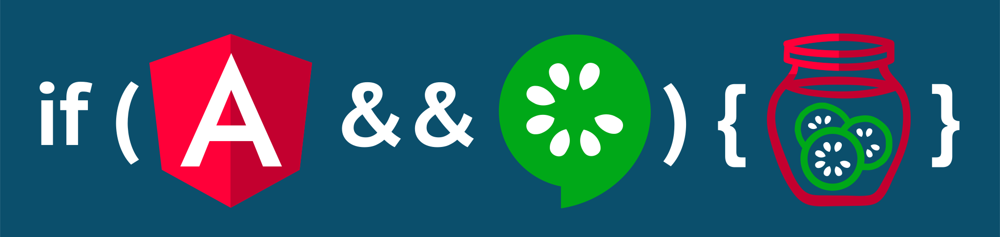

# Protractor Cucumber Slices



## Why use it?

Because testing is good, but writing your own step library is a dilly of a pickle.
Enjoy pre-sliced cucumber testing for protractor, ready to consume with no lengthy pickling.

## What is it?
**What?** A gherkin (cucumber) BDD step library for testing [Angular (ngx)](https://angular.io/) applications.

**See the [Steps](steps.md#table-of-contents) library to see what's included.**

### Simple Example

This type of thing works out of the box, without writing any code:

```gherkin
Feature: Login page

  Scenario: Login with valid credentials
    When I go to the homepage
    And I fill in the following:
      | Email    | person@company.com |
      | Password | notverysecurepw    |
    And I press "Login"
    Then I should see "Login successful."
    And I should be on the dashboard
    And I should see an "article" element
    And I should see "Welcome!" in the "h1" element
```

## How does it work?

It uses [protractor-cucumber-framework](https://www.npmjs.com/package/protractor-cucumber-framework) as the dressing for protractor. Other than that, cucumber steps can be written using plain protractor code without any seedy support code.

## Documentation

Note: docs can be hosted locally:

```bash
git clone https://matmar10.github.io/protractor-cucumber-slices
cd protractor-cucumber-slices
npm run docs:serve
```

* [Getting Started](https://matmar10.github.io/protractor-cucumber-slices/#/getting-started.md "Getting Started With Protractor and Cucumber")
* [Step Library](https://matmar10.github.io/protractor-cucumber-slices/#/steps.md#table-of-contents "Cucumber Step Library for Angular BDD Using Protractor")
* [Utilities](https://matmar10.github.io/protractor-cucumber-slices/#/utils.md "Supporting Utilities for Cucumber Using Protractor")

## Contributing

Contributions welcome :-)

You can generate the docs by running:

```bash
npm run docs:all
```

You can host

## Credits &amp; Acknowledgment

* Inspiration: https://github.com/Adezandee/cucumber-mink
* Logo credit: pickles by BomSymbols from the Noun Project
