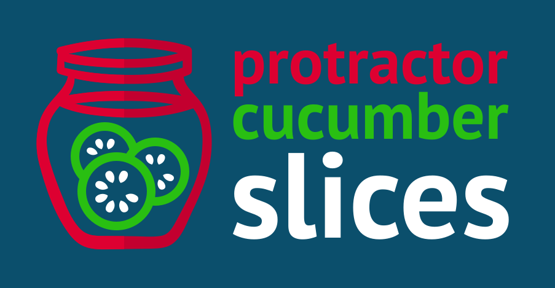

# Protractor Cucumber Slices



**Why?** Because testing is good, but writing your own step library is a dilly of a pickle.
Enjoy pre-sliced cucumber testing for protractor, ready to consume with no lengthy pickling.

**Where?** A gherkin (cucumber) BDD step library for testing [Angular](https://angular.io/) (ngx) apps.
See the [Steps](#steps) library to see what's included.

**How?** It uses [protractor-cucumber-framework](https://www.npmjs.com/package/protractor-cucumber-framework)
to wire protractor to cucumber. Other than that, it's just plain protractor.

**When?** Now! See [Getting Started](#getting-started)

Logo credit: pickles by BomSymbols from the Noun Project

## Simple Example

    Feature: Login page

      Scenario: Login with valid credentials
        When I go to the homepage
        And I fill in the following:
          | Email    | person@company.com |
          | Password | notverysecurepw    |
        And I press "Login"
        Then I should see "Login successful."
        And I should be on the dashboard
        And I should see an "article" element
        And I should see "Welcome!" in the "h1" element

## Getting Started

```javascript
npm install --save-dev cucumber protractor-cucumber-slices
```

### protractor.conf.js

```javascript
exports.config = {

  // change if you use a different base URL
  // this will effect set the baseUrl used in Navigation step library
  // NOTE: the BASE_URL env variable is updated by the 'base url' action
  baseUrl: process.env.BASE_URL || 'http://locahost:4200/',

  capabilities: {
    browserName:'chrome'
  },

  // this wires together protractor and cucumber
  framework: 'custom',
  frameworkPath: require.resolve('protractor-cucumber-slices'),

  // require feature files
  specs: [
    './e2e/features/**/*.feature'
  ],

  cucumberOpts: {
    require: [
      // include this step library
      path.resolve(process.cwd(), './node_modules/protractor-cucumber-mink'),
      // point this to wherever your own steps live
      path.resolve(process.cwd(), './e2e/**/*.steps.js'),
    ],
  },
  // https://github.com/angular/protractor/issues/4378
  directConnect: true,
};
```
