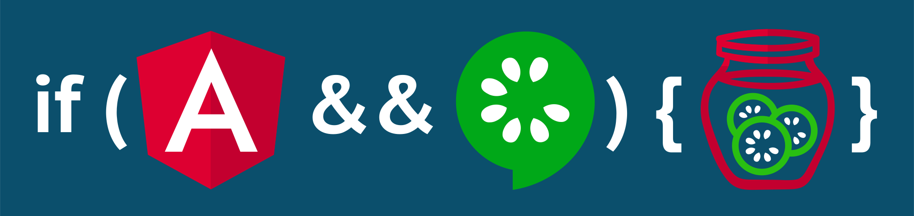

# Protractor Cucumber Slices



## Why use it?

Because testing is good, but writing your own step library is a dilly of a pickle.
Enjoy pre-sliced cucumber testing for protractor, ready to consume with no lengthy pickling.

## What is it?
**What?** A gherkin (cucumber) BDD step library for testing [Angular (ngx)](https://angular.io/) applications.

**See the [Steps](#steps) library to see what's included.**

### Simple Example

This type of thing works out of the box, without writing any code:

```gherkin
Feature: Login page

  Scenario: Login with valid credentials
    When I go to the homepage
    And I fill in the following:
      | Email    | person@company.com |
      | Password | notverysecurepw    |
    And I press "Login"
    Then I should see "Login successful."
    And I should be on the dashboard
    And I should see an "article" element
    And I should see "Welcome!" in the "h1" element
```

## How does it work?

It uses [protractor-cucumber-framework](https://www.npmjs.com/package/protractor-cucumber-framework) as the dressing for protractor. Other than that, cucumber steps can be written using plain protractor code without any seedy support code.

See [Getting Started](#getting-started)


Logo credit: pickles by BomSymbols from the Noun Project
